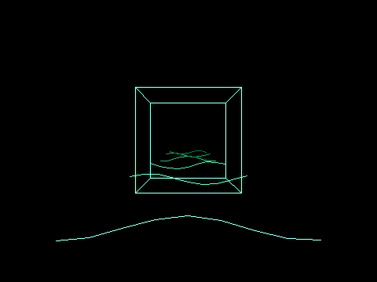
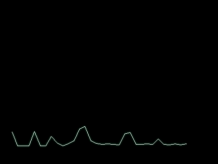
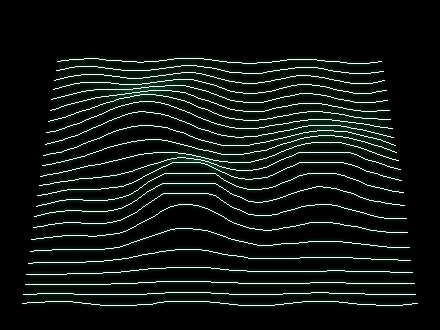

# pyvterm

[](https://github.com/anarkiwi/pyvterm/actions/workflows/ci.yml)
[](https://pypi.org/project/pyvterm/)
[](https://pypi.org/project/pyvterm/)
[](LICENSE)

**Drive a [PiTrex](https://github.com/gtoal/pitrex)/Vectrex over a serial port from Python.**

pyvterm speaks the **USB-DVG / _vecterm_ serial protocol** — the same wire format a
custom [MAME](https://www.mamedev.org/) build uses to push vector frames to a Vectrex
through the PiTrex. With pyvterm your Python program *becomes* the "custom MAME": you
build a frame of vectors and stream it to real hardware over a serial link.

The protocol is documented in full in [`docs/PROTOCOL.md`](docs/PROTOCOL.md);
[`docs/PROTOCOL-EXTENSIONS.md`](docs/PROTOCOL-EXTENSIONS.md) proposes
backward-compatible extensions for streaming structured, high-vector-count
content (raster video, spectra, parametric curves).

---

## How it fits together

```
┌─────────────────────────┐   USB-DVG / vecterm    ┌──────────────────┐   GPIO/VIA   ┌─────────┐
│  your Python program     │   protocol over a      │  PiTrex running  │  6522 VIA    │ Vectrex │
│  (pyvterm)  ── or ──      │ ─────────────────────▶ │  the "vecterm"   │ ───────────▶ │ CRT     │
│  a custom MAME build      │   serial @ 2 Mbaud     │  receiver        │              │ (beam)  │
└─────────────────────────┘                         └──────────────────┘              └─────────┘
```

pyvterm implements the **sender** half — exactly what
[`VMMenu/Win32/dvg/zvgFrame.c`](https://github.com/gtoal/pitrex/blob/master/VMMenu/Win32/dvg/zvgFrame.c)
does in the PiTrex repository (USB-DVG drivers by Mario Montminy, 2020), cross-checked
against AdvanceMAME's canonical [`advance/osd/dvg.c`](https://github.com/amadvance/advancemame/blob/master/advance/osd/dvg.c).

## Install

```bash
pip install pyvterm
```

pyvterm requires Python 3.9+ and depends only on [`pyserial`](https://pypi.org/project/pyserial/).

## Quick start

```python
from pyvterm import VectorTerminal

# Open the serial link (a USB-TTL adapter shows up as /dev/ttyUSB0 on Linux,
# pyvterm's default; a USB-CDC USB-DVG gadget is /dev/ttyACM0 instead).
with VectorTerminal(port="/dev/ttyUSB0") as vt:
    with vt.frame():                 # clears, then sends on exit
        vt.set_intensity(15)          # full brightness (0 = beam off)
        vt.polyline(                  # a centred square
            [(-200, -200), (200, -200), (200, 200), (-200, 200)],
            closed=True,
        )
```

No hardware handy? Swap in a `MemoryTransport` and inspect the bytes:

```python
from pyvterm import VectorTerminal, MemoryTransport, protocol

mem = MemoryTransport()
vt = VectorTerminal(transport=mem)
vt.set_intensity(15)
vt.draw_to(100, 0)                    # pen starts at (0, 0)
frame = vt.send_frame()
print([protocol.decode_word(int.from_bytes(frame[i:i+4], "big"))
       for i in range(0, len(frame), 4)])
```

## Coordinate system

The default host space matches MAME's vector resolution and the PiTrex `zvgFrame.h`
defaults: **X ∈ [−512, 511], Y ∈ [−384, 383]**, origin at centre. pyvterm maps these
onto the device's `0..4095` grid for you. Pass a custom `Bounds` to `VectorTerminal`
if you want different limits.

The Vectrex CRT is monochrome, so colour is really *intensity*: use
`set_intensity(0..15)`. A colour/intensity of `0` blanks the beam, turning the next
vector into an invisible move. (`set_rgb(r, g, b)` is available for protocol fidelity
with colour vector monitors.)

## API at a glance

| pyvterm | `zvgFrame.c` equivalent | Purpose |
| --- | --- | --- |
| `VectorTerminal(port=...)` / `.open(port)` | `zvgFrameOpen` | open the serial link |
| `.set_rgb(r, g, b)` / `.set_intensity(n)` | `zvgFrameSetRGB15` | set colour/brightness |
| `.set_clip_window(...)` | `zvgFrameSetClipWin` | set the clip rectangle |
| `.vector(x0, y0, x1, y1)` | `zvgFrameVector` | add one vector |
| `.move_to` / `.draw_to` / `.polyline` | — | pen-style convenience helpers |
| `.send_frame()` | `zvgFrameSend` | serialise + transmit the frame |
| `.close()` | `zvgFrameClose` | send `EXIT`, close the port |

Lower-level building blocks are exposed too: `pyvterm.protocol` (pure word
encoders/decoders), `pyvterm.geometry` (clipping), `FrameBuilder` (assemble a frame
to bytes without any I/O), and the `Transport` hierarchy
(`SerialTransport`, `MemoryTransport`). The optional `pyvterm.preview` module
(`pip install "pyvterm[preview]"`) decodes frames back into beam segments and
renders them to images or animated PNGs — handy for previewing without hardware.

## Examples

### Lissajous patterns

[`examples/lissajous.py`](examples/lissajous.py) animates Lissajous curves on the
display:


*Animated preview (open the PNG to play it) rendered by `--preview`.*

```bash
# On real hardware:
python examples/lissajous.py --port /dev/ttyUSB0

# Without hardware (prints per-frame byte counts):
python examples/lissajous.py --dry-run --frames 5

# Render the animated PNG above (no hardware; needs the preview extra):
pip install "pyvterm[preview]"
python examples/lissajous.py --preview lissajous.png
```

### 3D rotating cube

[`examples/cube3d.py`](examples/cube3d.py) flies a wireframe cube around the
screen: it tumbles on all three axes, drifts along a Lissajous path, and swings
toward and away from the viewer so perspective makes it loom up close and shrink
into the distance. The projection is plain trigonometry — no numpy — so it runs
from the **core package alone** (only `--preview` needs the preview extra).



*Animated preview (open the PNG to play it) rendered by `--preview` — exactly
the vectors the device would draw, reconstructed from the wire bytes. The motion
loops seamlessly over one `--period`.*

```bash
# On real hardware:
python examples/cube3d.py --port /dev/ttyUSB0

# Without hardware (prints per-frame byte/vector counts and distance):
python examples/cube3d.py --dry-run --frames 5

# Render the animated PNG above (no hardware; needs the preview extra):
pip install "pyvterm[preview]"
python examples/cube3d.py --preview cube3d.png
```

### 3D spectrum analyzer

[`examples/spectrum3d.py`](examples/spectrum3d.py) is a real-time **3D waterfall
spectrum analyzer**: it captures live audio (ALSA), runs an FFT each frame, and
draws frequency across X, magnitude as height, and time receding into the
distance. The slab is viewed through an **orbiting camera** that is never quite
still — it drifts slowly in steady state, and when the audio makes a **major
change** (an onset or new texture, detected via spectral flux) it sweeps round
to a fresh viewpoint. Pass `--no-rotate` for a fixed head-on view.



*Animated preview (open the PNG to play it) rendered by `--preview` from the
built-in synthetic source — exactly the vectors the device would draw,
reconstructed from the wire bytes. Watch the camera swing to a new angle each
time the spectrum shifts.*

```bash
# Live, visualising the default output by tapping its monitor
# (Linux; needs pyalsaaudio):
pip install "pyvterm[analyzer]" pyalsaaudio
PULSE_SOURCE=@DEFAULT_SINK@.monitor python examples/spectrum3d.py --device pulse

# No hardware? Render the animated PNG above from synthetic audio:
pip install "pyvterm[preview]"
python examples/spectrum3d.py --synthetic --preview spectrum3d.png

# Or just stream synthetic audio to a real Vectrex:
python examples/spectrum3d.py --synthetic --port /dev/ttyUSB0
```

### Rutt-Etra video scan processing

[`examples/ruttetra.py`](examples/ruttetra.py) reads video with OpenCV (a file, a
camera, or any `cv2.VideoCapture` source) and renders a [Rutt-Etra](https://en.wikipedia.org/wiki/Rutt/Etra_Video_Synthesizer)
style scan: each frame is reduced to a coarse grid and every scan line is drawn
as a polyline displaced vertically by luminance — a flat image becomes a 3D
relief of horizontal lines, which is exactly what a vector display does best.



*Animated preview (open the PNG to play it) rendered by `--preview` from the
built-in synthetic scene.*

The Vectrex can only draw so many vectors per refresh, so the grid is kept
small; turn `--cols` (horizontal resolution), `--rows` (scan lines / line
spacing) and `--fps` down further if your display flickers.

```bash
# Live webcam to a real Vectrex (needs OpenCV):
pip install "pyvterm[video]"
python examples/ruttetra.py --video 0 --port /dev/ttyUSB0

# A video file, downscaled and slowed for the Vectrex:
python examples/ruttetra.py --video clip.mp4 --cols 40 --rows 22 --fps 12 --port /dev/ttyUSB0

# No camera? Render the animated PNG above from the synthetic scene:
pip install "pyvterm[preview]"
python examples/ruttetra.py --synthetic --preview ruttetra.png
```

## Connecting to the hardware

pyvterm just needs a serial port that reaches the PiTrex. The PiTrex hosts a
Raspberry Pi Zero on its GPIO header, and there are two places to attach a host
link — the [**PiTrex Developer Release Hardware Guide**][hwguide] is the
authoritative reference for the header location and exact wiring.

- **USB gadget port (simplest, easily fast enough).** The Pi Zero's *data*
  micro-USB port — the inner one marked **USB**, not **PWR** — can act as a
  USB-CDC serial gadget and shows up on your PC as `/dev/ttyACM0` (pass
  `port="/dev/ttyACM0"`). USB-CDC ignores the line rate, so the nominal 2 Mbaud is met with
  room to spare and **no serial adapter is required** — just a micro-USB-to-USB-A
  *data* cable. Remove the **POWER FROM VEC.** jumper first, since the PC then
  supplies power.
- **GPIO UART header.** Alternatively wire a USB-to-TTL adapter to the Pi Zero
  header pins **1 (3.3 V), 6 (GND), 8 (Tx, GPIO14), 10 (Rx, GPIO15)**, crossing
  Tx↔Rx, and set `enable_uart=1` in `config.txt` (this is the guide's documented
  serial-console path). The adapter shows up on your PC as `/dev/ttyUSB0` —
  pyvterm's default port, and the link the baremetal `vekterm` receiver uses.
  Going this route, the adapter itself must keep up.

### Choosing a USB-to-serial adapter

For the GPIO-UART route the adapter has to satisfy two hard requirements:

- **3.3 V logic levels — never 5 V** (5 V on the Pi's pins will damage it).
- **Sustain ≥ 2 Mbaud**, the protocol's line rate.

A genuine **FTDI FT232R**-based 3.3 V adapter is the safe pick — it is rated to
3 Mbaud, comfortably above the 2 Mbaud the protocol asks for:

- [FTDI **TTL-232R-3V3**](https://ftdichip.com/wp-content/uploads/2023/07/DS_TTL-232R_CABLES.pdf)
  — 3.3 V FT232R USB-to-TTL cable (datasheet; rated to 3 Mbaud). Choose the
  0.1″-socket variant so it drops onto the header pins.
- [Adafruit **FTDI Friend**](https://www.adafruit.com/product/284) — FT232RL,
  switchable to 3.3 V.
- A **Silicon Labs CP2102N** board (rated to 3 Mbaud) is a fine alternative.

Avoid low-cost **CH340** modules and anything labelled only **CP2102** (the
original tops out near 1 Mbaud) — they are unreliable at 2 Mbaud. The USB gadget
port above sidesteps the line-rate question entirely, so it's the recommended
path unless you specifically need the UART pins.

[hwguide]: http://www.ombertech.com/cnk/pitrex/wiki/index.php?wiki=Developer_Release_HW_Guide

### Notes

- Host device path: default `/dev/ttyUSB0` (a USB-TTL adapter on Linux); a
  USB-CDC USB-DVG gadget instead enumerates as `/dev/ttyACM0` (Linux),
  `/dev/tty.usbmodem*` (macOS), or `COMx` (Windows). Pass `port=` to override.
- Baud rate: the default is `baudrate="auto"`, which probes the candidate rates
  (`DEFAULT_BAUD_CANDIDATES`, matching vekterm's cycleable splash options) with
  the `HELLO` capability probe and keeps the one the receiver answers on — so a
  raw-UART receiver is found whatever rate its operator selected. Pass a number
  (e.g. `baudrate=2_000_000`) to skip detection; a USB-CDC device ignores the
  rate anyway and falls back to `2 Mbaud` if nothing answers.
- `SerialTransport` waits ~2 s after opening before flushing buffers (the
  reference driver does the same "to make flush work, for some reason"); pass
  `settle=0` to skip it.
- The library is silent by default — it prints nothing. The examples are too:
  pass `--debug` (or `--debug N` for an N-second period) to print one telemetry
  line per period with the outbound I/O rate and the min/mean/max vector count
  and draw time the device reports in its v2 sync record. `pyvterm.DebugReporter`
  exposes the same readout for your own loops.

## Development

```bash
python -m venv .venv && . .venv/bin/activate
pip install -e ".[dev]"
ruff check . && ruff format --check .
mypy
pytest
```

## Credits

The protocol and the PiTrex platform are the work of Graham Toal and contributors
([gtoal/pitrex](https://github.com/gtoal/pitrex)); the USB-DVG drivers this library
mirrors were written by Mario Montminy. pyvterm is an independent, clean-room Python
reimplementation of the sender protocol.

## License

Apache-2.0. See [LICENSE](LICENSE).
